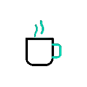

<h1 align="center"> Hi! I'm Mizanur Rahman 👋</h1>

I am a CSE Student and a competitive programmer.I am also a tech enthusiastic and love to always learn something new of technology.

 
 

<h1>💡 Tech Stack</h1>

<table border="1" cellpadding="10" cellspacing="0" style="border-collapse: collapse; width: 80%; text-align: left; font-family: Arial, sans-serif; margin: auto;">
  <thead style="background-color: #007bff; color: white;">
    <tr>
      <th>Skill Category</th>
      <th>Skills</th>
    </tr>
  </thead>
  <tbody>
    <tr>
      <td>💻 Programming Languages </td>
       <td>• C &nbsp; • C++ &nbsp; • Java &nbsp; • Python&npsp;  • JavaScript &nbsp;  • Dart &nbsp;</td>
    </tr>
    <tr>
      <td>🌐 Web Development </td>
       <td>• HTML &nbsp; • CSS &nbsp; </td>
    </tr>
    <tr>
      <td>📱 Mobile / Backend </td>
       <td>• Flutter &nbsp; • Firebase &nbsp;  • Django &nbsp;  • Rest Framework &nbsp;  </td>
    </tr>
    <tr>
      <td> 🗄️ Databases </td>
      <td>• MySQL &nbsp; • SQLite &nbsp;  • PostgreSQL &nbsp;  </td>
    </tr>
    <tr>
      <td>⚙️ Tools / Deployment </td>
       <td>• Git &nbsp; • GitHub &nbsp;  • Docker &nbsp; • Postman &nbsp; • VS Code &nbsp;• Andorid Studio &nbsp; </td>
    </tr>
  </tbody>
</table>

   

<h1>Best Projects</h1>

    

        
        
        
      <strong style="color: lightgreen;">    Money Management :</strong>
      <a href="https://github.com/mizan92782/FLUTTER-LEARNING./tree/main/Project/my_money" target="_blank" style="color: lightgreen; text-decoration: none; font-weight: bold;">View Project</a>
    

    

  

    
    <strong>Programming-learning-and-QuizApp :  </strong>
    <a href="https://github.com/mizan92782/Programming-learning-and-QuizApp" target="_blank" style="color: #007bff;">View Project</a>
  

 

